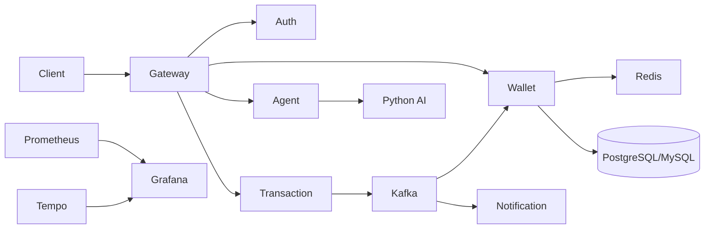

# 🌐 Distributed Fintech Wallet System

A distributed fintech wallet platform built using **Spring Boot Microservices**, **Apache Kafka**, **Redis**, **React**, **Spring AI**, and **PostgreSQL/MySQL**. The project showcases enterprise backend concepts including distributed transactions, event-driven communication, CQRS, Event Sourcing, caching, AI integration, observability, and cloud deployment.

---

# 📖 Overview

The application provides secure wallet management and digital money transfer capabilities using a microservices architecture. Each service has a clear responsibility and communicates synchronously using REST and asynchronously using Apache Kafka.

## Core Objectives

- Secure digital wallet platform
- Reliable money transfers
- Distributed transaction consistency
- Event-driven communication
- High maintainability through microservices
- AI-powered user assistance
- Fraud detection
- Cloud-ready deployment

---

# 🎯 Project Highlights

- Spring Boot Microservices
- Spring Cloud Gateway
- Spring Security + JWT
- Apache Kafka Event Streaming
- Saga Orchestration
- Transactional Outbox Pattern
- Consumer Inbox Pattern
- Event Sourcing
- CQRS
- Redis Caching
- Redis Distributed Locking
- Spring AI + Groq
- Python FastAPI Fraud Detection
- Docker & Kubernetes
- AWS EC2
- Prometheus + Grafana + OpenTelemetry + Tempo

---

# 🏗️ System Architecture



---

# ✨ Features

## 🔐 Authentication & Security

- User Registration
- Login
- JWT Authentication
- Role-Based Authorization
- Password Encryption
- Email OTP
- SMS OTP

## 💳 Wallet

- Wallet Creation
- Deposit
- Withdrawal
- Balance Inquiry
- Transaction History
- Wallet-to-Wallet Transfer

## 🔄 Distributed Transactions

- Saga Orchestration
- Compensation Logic
- Reliable Cross-Service Transfers

## ⚡ Event Driven

- Kafka Producers
- Kafka Consumers
- Domain Events
- Async Notifications

## 📝 Event Sourcing

Every financial operation is stored as an immutable **Ledger Entry**.

### Implementation

- Append-only Ledger
- Wallet Audit Trail
- Snapshot Creation
- Wallet Balance Rebuild
- Historical State Recovery

Balance reconstruction uses ledger events and snapshots instead of relying only on the wallet table.

## ⚖️ CQRS

### Command Side

- Wallet Updates
- Transfers
- Ledger Creation
- Kafka Publishing
- Saga Coordination

### Query Side

- Materialized Wallet View
- Redis Cached Balance
- Transaction Queries

Read operations are optimized independently from write operations.

## 🤖 AI

- Spring AI Agent
- Groq LLM
- Natural Language Wallet Queries
- Fraud Detection Service
- Transaction Categorization

---

# 🧩 Microservices

| Service | Responsibility |
|----------|----------------|
| API Gateway | Routing, Security |
| Auth Service | Authentication |
| Wallet Service | Wallet, Ledger, CQRS, Event Sourcing |
| Transaction Service | Transfers, Saga, Outbox |
| Notification Service | Email & SMS |
| Agent Service | AI Assistant |
| AI Service | Fraud Detection |

---

# ⚙️ Design Patterns

## Saga Pattern
Coordinates distributed transactions using compensation.

## Transactional Outbox
Guarantees reliable Kafka publishing.

## Consumer Inbox
Ensures idempotent message processing.

## Event Sourcing
Stores immutable ledger events and supports rebuilding wallet state.

## CQRS
Separates write commands from optimized read operations.

## Redis Distributed Lock
Prevents concurrent balance modification conflicts.

## Redis Cache
Caches frequently requested wallet information.

---

# 📡 Kafka Topics

- wallet-events
- transaction-events
- notification-events
- compensation-events

---

# 📦 Technology Stack

### Backend

- Java 17
- Spring Boot
- Spring Security
- Spring Cloud Gateway
- Spring Data JPA
- Hibernate

### Frontend

- React
- TypeScript
- Vite
- Tailwind CSS
- Zustand
- React Query

### Database

- PostgreSQL
- MySQL
- Redis

### Messaging

- Apache Kafka
- Zookeeper

### AI

- Spring AI
- Groq
- OpenAI
- FastAPI
- Scikit-Learn

### DevOps

- Docker
- Docker Compose
- Kubernetes
- AWS EC2

### Monitoring

- Prometheus
- Grafana
- OpenTelemetry
- Tempo

---

# 📁 Project Structure

```text
distributed-wallet-system/
├── api-gateway/
├── auth-service/
├── wallet-service/
├── transaction-service/
├── notification-service/
├── ai-service/
├── agent-service/
├── consumer-wallet-v2/
├── common-events/
├── k8s/
├── monitoring/
├── docker-compose.yml
└── README.md
```

---

# 🚀 Getting Started

## Prerequisites

- Java 17+
- Maven
- Node.js
- Python
- Docker Desktop

## Clone

```bash
git clone <repository-url>
cd distributed-wallet-system
```

## Start Infrastructure

```bash
docker compose up -d
```

## Run Services

```bash
mvn spring-boot:run
```

or

```powershell
./start_all_services.ps1
```

## Frontend

```bash
cd consumer-wallet-v2
npm install
npm run dev
```

---

# 🐳 Deployment

- Docker Compose
- Kubernetes
- AWS EC2

---

# 📊 Monitoring

- Spring Boot Actuator
- Prometheus
- Grafana
- OpenTelemetry
- Tempo

---

# 📸 Screenshots

Add screenshots for:

- Login
- Dashboard
- Wallet
- Transfer
- Transaction History
- Swagger
- Kafka UI
- Grafana
- AI Chat

---

# 🔮 Future Improvements

- Keycloak Authentication
- GitHub Actions CI/CD
- ELK Stack
- Horizontal Pod Autoscaler
- Multi-region Deployment

---

# 👨‍💻 Author

**Manikam**

Java Backend Developer

**Skills**

Java • Spring Boot • Microservices • Kafka • Redis • PostgreSQL • MySQL • React • Docker • Kubernetes • AWS • Spring AI

---

⭐ If you found this project useful, consider giving it a star!
