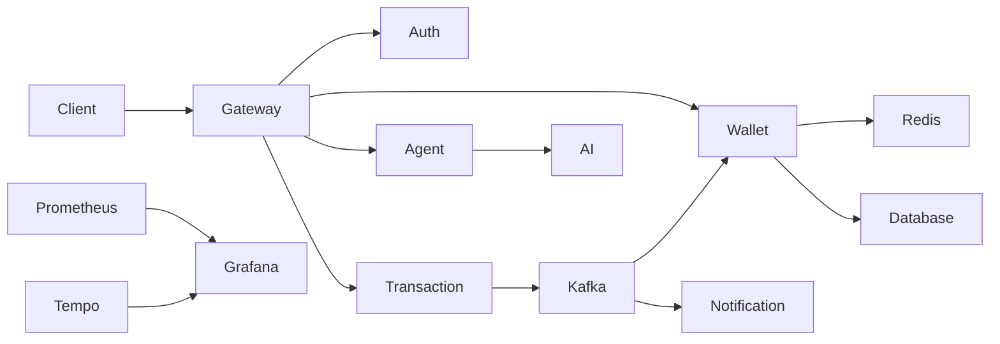

# 🌐 Distributed Fintech Wallet System

# 📖 Overview

This project demonstrates modern backend engineering concepts including:

- Microservices Architecture
- Spring Security & JWT Authentication
- Distributed Transactions (Saga Pattern)
- Apache Kafka Event-Driven Communication
- Redis Caching & Distributed Locking
- AI Integration using Spring AI & Groq
- Fraud Detection using Python FastAPI
- Docker & Kubernetes Deployment
- AWS EC2 Deployment
- Monitoring with Prometheus, Grafana, OpenTelemetry & Tempo

---

# 🎯 Project Highlights

- Secure Wallet-to-Wallet Money Transfers
- Event-Driven Architecture with Kafka
- Saga Orchestration
- Transactional Outbox Pattern
- Consumer Inbox Pattern
- Redis Distributed Locking
- Redis Caching
- AI Financial Assistant
- Fraud Detection Service
- Observability & Distributed Tracing

---

# 🏗️ System Architecture

> Replace the following section with your Mermaid diagram or architecture image.



---

# ✨ Features

## 🔐 Authentication & Security

- User Registration
- User Login
- JWT Authentication
- Spring Security
- Password Encryption
- Email OTP
- SMS OTP
- Role-Based Authorization

## 💳 Wallet Management

- Wallet Creation
- Deposit Money
- Withdraw Money
- Wallet Balance
- Transaction History
- Wallet-to-Wallet Transfer

## 🔄 Distributed Transactions

- Saga Pattern
- Compensation Transactions
- Reliable Money Transfer
- Event-Based Processing

## ⚡ Event-Driven Architecture

- Apache Kafka Producer
- Apache Kafka Consumer
- Asynchronous Notifications
- Decoupled Microservices

## 🚀 Performance

- Redis Caching
- Redis Distributed Locking
- API Gateway
- Scalable Microservices

## 🤖 AI Features

- Spring AI Agent
- Groq Llama Integration
- Natural Language Wallet Assistant
- Python FastAPI Fraud Detection

## 📊 Monitoring

- Prometheus
- Grafana
- OpenTelemetry
- Grafana Tempo

---

# 🧩 Microservices

| Service | Description |
|---------|-------------|
| API Gateway | Request routing and JWT validation |
| Auth Service | Authentication & Authorization |
| Wallet Service | Wallet operations and caching |
| Transaction Service | Saga orchestration and transfers |
| Notification Service | Email & SMS notifications |
| AI Service | Fraud detection |
| Agent Service | Spring AI chatbot |

---

# 🛠️ Technology Stack

## Backend

- Java 17
- Spring Boot
- Spring Security
- Spring Cloud Gateway
- Spring Data JPA
- Hibernate

## Frontend

- React
- TypeScript
- Vite
- Tailwind CSS
- Zustand
- React Query

## Database

- PostgreSQL
- MySQL
- Redis

## Messaging

- Apache Kafka
- Zookeeper

## AI

- Spring AI
- Groq API
- OpenAI API
- FastAPI
- Scikit-Learn

## DevOps

- Docker
- Docker Compose
- Kubernetes
- AWS EC2

## Monitoring

- Prometheus
- Grafana
- OpenTelemetry
- Tempo

---

# ⚙️ Design Patterns

### Saga Pattern
Coordinates distributed transactions across multiple microservices.

### Transactional Outbox Pattern
Ensures reliable Kafka event publishing.

### Consumer Inbox Pattern
Prevents duplicate event processing.

### Redis Distributed Lock
Protects concurrent wallet updates.

### Redis Caching
Improves read performance by caching frequently accessed data.

---

# 📁 Project Structure

```text
distributed-wallet-system/
│
├── api-gateway/
├── auth-service/
├── wallet-service/
├── transaction-service/
├── notification-service/
├── ai-service/
├── agent-service/
├── consumer-wallet-v2/
├── common-events/
├── monitoring/
├── k8s/
├── docker-compose.yml
└── README.md
```

---

# 📸 Screenshots

Add screenshots here:

- Login Page
- Dashboard
- Wallet
- Money Transfer
- Transaction History
- Swagger UI
- Grafana Dashboard
- Kafka UI
- AI Chat Assistant

---

# 🚀 Getting Started

## Prerequisites

- Java 17+
- Maven 3.8+
- Node.js 18+
- Python 3.10+
- Docker Desktop

## Clone Repository

```bash
git clone https://github.com/yourusername/distributed-wallet-system.git
cd distributed-wallet-system
```

## Start Infrastructure

```bash
docker compose up -d
```

## Run Backend

```bash
mvn spring-boot:run
```

or

```powershell
.\start_all_services.ps1
```

## Run Frontend

```bash
cd consumer-wallet-v2
npm install
npm run dev
```

---

# 🐳 Deployment

Supports deployment using:

- Docker Compose
- Kubernetes
- AWS EC2

---

# 📊 Monitoring & Observability

- Spring Boot Actuator
- Prometheus
- Grafana
- OpenTelemetry
- Grafana Tempo

---

# 🔮 Future Enhancements

- Event Sourcing
- CQRS
- Keycloak Authentication
- ELK Stack
- GitHub Actions CI/CD
- Horizontal Pod Autoscaler

---

# 👨‍💻 Author

**Manikam**

Java Backend Developer

**Tech Stack**

- Java
- Spring Boot
- Spring Security
- Spring Cloud
- Kafka
- Redis
- PostgreSQL
- MySQL
- React
- Docker
- Kubernetes
- AWS
- Spring AI

---

⭐ If you found this project useful, consider giving it a star!
