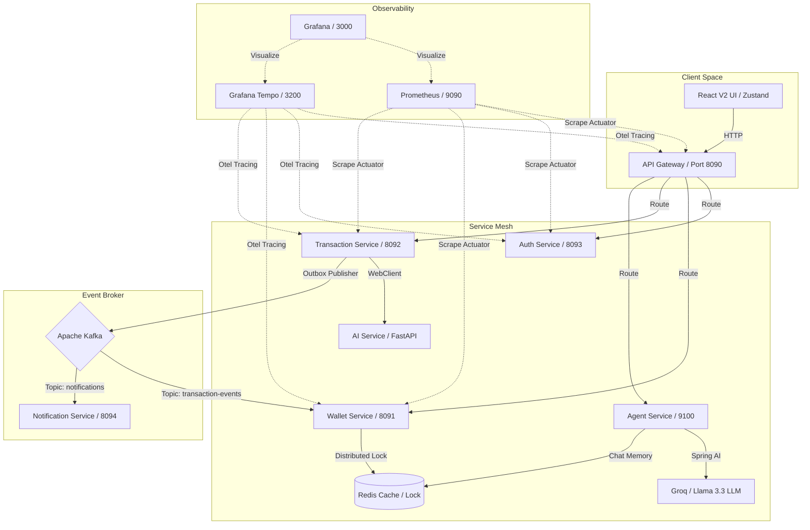

# 🌐 Distributed Fintech Wallet System

[](https://spring.io/projects/spring-boot)
[](https://react.dev/)
[](https://spring.io/projects/spring-ai)
[](https://www.docker.com/)
[](https://grafana.com/)
[](https://kafka.apache.org/)

## 📖 Project Overview
An enterprise-grade, high-performance distributed wallet and transaction platform. The system is architected around decentralized microservices, reactive event-driven processing, distributed transactional coordination (Saga Orchestration), strict idempotency guarantees, and AI-powered capabilities (Fraud Detection & Conversational Agent). It exposes secure REST APIs for wallet management, payments, and transaction processing.

---

## 🗺️ Architecture Diagram (Mermaid)


```mermaid
flowchart TD
    subgraph Client Space
        UA[React V2 UI / Zustand] -->|HTTP| GW[API Gateway / Port 8090]
    end

    subgraph Service Mesh
        GW -->|Route| AUTH[Auth Service / 8093]
        GW -->|Route| WS[Wallet Service / 8091]
        GW -->|Route| TS[Transaction Service / 8092]
        GW -->|Route| AGENT[Agent Service / 9100]
        
        TS -->|WebClient| AI[AI Service / FastAPI]
        AGENT -->|Spring AI| GROQ[Groq / Llama 3.3 LLM]
        WS -->|Distributed Lock| REDIS[(Redis Cache / Lock)]
        AGENT -->|Chat Memory| REDIS
    end

    subgraph Event Broker
        TS -->|Outbox Publisher| KAFKA{Apache Kafka}
        KAFKA -->|Topic: transaction-events| WS
        KAFKA -->|Topic: notifications| NS[Notification Service / 8094]
    end

    subgraph Observability
        PROM[Prometheus / 9090] -.->|Scrape Actuator| GW & AUTH & WS & TS
        TEMPO[Grafana Tempo / 3200] -.->|Otel Tracing| GW & AUTH & WS & TS
        GRAF[Grafana / 3000] -.->|Visualize| PROM & TEMPO
    end
```

---

## 🖼️ System Architecture Image
*(Replace this with an actual diagram image of your architecture if you have one)*


---

## ✨ Core Features
* **High-Performance Distributed Wallet**: Managed via secure REST APIs for robust wallet provisioning, peer-to-peer payments, and ledger processing.
* **Resilient Distributed Transactions**: Money transfers span multiple microservices without data loss or inconsistency, utilizing event-driven compensation loops.
* **Intelligent AI Capabilities**: Natural Language interaction for checking balances and executing transfers, plus real-time fraud scoring.
* **High Throughput & Low Latency**: 3x–5x system throughput increase and up to 80% latency reduction achieved through asynchronous event-driven workflows.
* **Scalable Event Messaging**: Employs Apache Kafka for decoupled, partition-aware service communication (wallet updates, transaction orchestration, notifications).

---

## 📦 Microservices Overview

1. **`api-gateway` (Port: 8090):** Spring Cloud Gateway handling JWT authentication, dynamic routing, Rate Limiting, and correlation ID tracking.
2. **`auth-service` (Port: 8093):** Registration, JWT issuance, password hashing, and Twilio/SMTP OTP verification.
3. **`wallet-service` (Port: 8091):** Manages materialized balance views, Redis caching, and Event-Sourced audit logs. Uses Distributed Locks (Redis) for strict transactional integrity.
4. **`transaction-service` (Port: 8092):** The **Saga Orchestrator**. Uses Outbox/Inbox tables to safely publish and consume Kafka messages without data loss.
5. **`notification-service` (Port: 8094):** Consumes `notificationTopic` from Kafka and fires asynchronous Twilio SMS and SMTP Email alerts.
6. **`agent-service` (Port: 9100):** Spring AI based intelligent assistant powered by Groq (Llama 3.3). Native function calling (Tools) to interact with user wallets via natural language.
7. **`ai-service` (Port: 8095):** FastAPI application handling real-time transaction fraud scoring, NLP intent extraction, and budget categorization.

---

## 💻 Technology Stack
* **Backend:** Java 17, Spring Boot 3.2, Spring Cloud, Spring AI, Spring Security, JPA/Hibernate.
* **Frontend:** React 19, Vite, TypeScript, Tailwind CSS 4, Zustand, React Query, Shadcn UI.
* **Databases:** PostgreSQL / MySQL (Primary persistence), Redis (Caching & Distributed Locks).
* **Messaging:** Apache Kafka, Zookeeper.
* **AI / ML:** Python, FastAPI, Scikit-Learn, Groq Cloud (Llama 3.3 70B), OpenAI.
* **Observability:** Prometheus, Grafana, OpenTelemetry, Grafana Tempo.
* **Infrastructure:** Docker, Docker Compose, Kubernetes, AWS EC2.

---

## 🛠️ Design Patterns Used

### 1. Saga Orchestration (Money Transfers)
Cross-service money transfers require a multi-step distributed transaction.
* `transaction-service` acts as the Orchestrator. It asks `wallet-service` to **Debit** the sender and **Credit** the receiver.
* **Compensation Logic**: If the receiver credit fails or times out, the Orchestrator fires a `WalletCompensationEvent`. The `wallet-service` consumes this and refunds the sender, rolling back the Saga securely.

### 2. Transactional Outbox Pattern (Guaranteed Delivery)
To prevent split-brain scenarios where a database commits but the Kafka broker crashes:
* Business data and an event payload are saved in the same local database transaction to an `OutboxEvent` table (`published = false`).
* An async worker polls the `OutboxEvent` table (`SKIP LOCKED`), pushes to Kafka, waits for acknowledgement, and then marks `published = true`.

### 3. Consumer Inbox Pattern (Idempotency)
Because Kafka guarantees "At-Least-Once" delivery, network retries can duplicate messages.
* Every Kafka message contains a unique UUID. Consumers check an `InboxEvent` table before processing.
* The message is processed and recorded in the table within a single DB transaction. If the UUID already exists, it is silently ignored, preventing double-spending.

### 4. Distributed Lock (Safety)
* **Concurrency Handling**: Improved concurrency handling and prevented conflicting updates using Redis distributed locks (`SETNX`).
* During balance modifications, the service acquires a Redis lock for the specific Wallet ID, updates the DB, and releases the lock.

### 5. Write-Through Caching (Performance)
* **Aggressive Optimization**: Reduced database reads by 95% using Redis write-through caching (`@Cacheable`) for frequently accessed wallet and transaction data, significantly lowering database IOPS.

---

## 🧠 AI Features
* **AI Financial Assistant (`agent-service`):** A conversational agent powered by Groq (Llama 3.3). Users can ask "What is my balance?" or "Send $50 to John", and the agent natively invokes Spring AI Tools (Function Calling) to fetch data and trigger transactions.
* **Real-Time Fraud Inference (`ai-service`):** Evaluates transaction metadata (amount, velocity, location change) against a Random Forest classifier to flag suspicious payments instantly.
* **Smart NLP Extraction:** Parses unstructured chat messages to extract payment intents, amounts, and due dates.

---

## 📸 Project Screenshots

*(Add your image links below once captured)*

* **React UI Dashboard:**  
  
* **AI Agent Chat Interface:**  
  
* **Swagger API Documentation:**  
  
* **Grafana Observability Dashboard:**  
  
* **Kafka UI / Topic Flow:**  
  

---

## 📁 Folder Structure
```text
distributed-wallet-microservices/
├── agent-service/          # Spring AI agent & Groq integration
├── ai-service/             # Python FastAPI Fraud & NLP models
├── api-gateway/            # Spring Cloud Gateway & Security
├── auth-service/           # User Identity, Registration & JWT
├── common-events/          # Shared DTOs and Kafka Event schemas
├── consumer-wallet-v2/     # New React 19 / Vite Frontend
├── k8s/                    # Kubernetes deployment descriptors
├── monitoring/             # Prometheus config and rules
├── notification-service/   # Email/SMS dispatcher (Kafka Consumer)
├── transaction-service/    # Saga Orchestrator & Outbox logic
├── wallet-service/         # Ledger, Caching, & Distributed Locks
├── docker-compose.yml      # Local orchestration
└── pom.xml                 # Root Maven POM
```

---

## 🚀 Local Setup

### Prerequisites
- Java 17, Maven 3.8+
- Node.js 18+ (for frontend)
- Python 3.10+ (for Python AI Service)

### Building the Microservices
```bash
# Clean build the main project
mvn clean install -DskipTests
```
You can then run the services individually using `mvn spring-boot:run` in their respective directories, or use the provided scripts.

### Starting the V2 Frontend
```bash
cd consumer-wallet-v2
npm install
npm run dev
```
Access the UI at: [http://localhost:5173](http://localhost:5173).

---

## 🐳 Docker Deployment
Bring up the backing databases, Redis, Kafka, Observability stack, and all Spring Boot microservices locally:

```bash
docker compose up -d --build
```
*This spins up MySQL, Redis, Zookeeper, Kafka, Prometheus, Grafana, Tempo, and all backend APIs seamlessly.*

---

## ☁️ AWS Deployment
The repository contains PowerShell automation (`aws-setup.ps1`) to spin up a production-ready `t3.large` Ubuntu EC2 instance, map Elastic IPs, inject security groups, and deploy the entire stack using Docker Compose.

```powershell
Set-ExecutionPolicy Bypass -Scope Process
.\aws-setup.ps1
```
Use `aws-stop.ps1` and `aws-resume.ps1` to manage costs when not actively testing.

---

## 🔮 Future Enhancements
* Implement a specialized Notification Preferences UI allowing users to toggle SMS/Email alerts.
* Transition to full Kubernetes deployments (Helm Charts) for production self-healing.
* Extend the AI Service to provide predictive cash-flow forecasting using deep learning models.
* Implement GraphQL for aggregate frontend queries (reducing gateway chatter).

---

## 🤝 Author & Contact
**[Your Name / Alias]**
* **LinkedIn:** [linkedin.com/in/yourprofile](#)
* **GitHub:** [github.com/yourusername](#)
* **Email:** your.email@example.com
